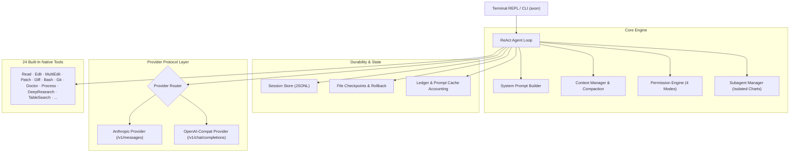

# Axon (vGPR_27)

<div align="center">

```
  ▲█▲   A X O N
  █⚡█   Terminal-Native Agentic Coding Assistant
```

[](tests/)
[](pyproject.toml)
[](docs/01-ARCHITECTURE.md)
[](LICENSE)

**Axon** is a production-grade, terminal-native AI coding assistant built from first principles. It reads entire codebases, architects multi-step plans, performs surgical code edits, executes shell workflows, validates test results, and coordinates concurrent subagents — with full prompt cache cost accounting, rollback checkpoints, and zero external agent frameworks.

</div>

---

## ⚡ Quickstart (30 Seconds)

### 1. Clone & Install
```bash
git clone https://github.com/gpr-27/axon.git
cd axon

# Automated setup (installs package and initializes global ~/.axon)
./install.sh
```

*(Alternatively, install with pip directly: `pip install -e .`)*

### 2. Configure Your API Key
Set your API key via environment variable or in `~/.axon/.env`:
```bash
export AXON_API_KEY="your-api-key-here"
export AXON_BASE_URL="https://agentrouter.org"   # Or any Anthropic / OpenAI compatible endpoint
```

### 3. Launch Axon Anywhere
Run Axon in any repository or directory on your laptop:
```bash
# Interactive REPL in current directory
axon

# Direct one-shot execution
axon -p "Find and fix all broken unit tests in src/"

# Resume latest conversation
axon --continue
```

---

## 📂 Understanding the `.axon` Directories (Global vs. Local)

When using Axon, you will encounter two `.axon` directories. Here is how they differ:

```
┌─────────────────────────────────────────────────────────────────────────────┐
│ 1. GLOBAL PROFILE: ~/.axon/  (Your Entire Laptop)                           │
├─────────────────────────────────────────────────────────────────────────────┤
│ • Path: /Users/<user>/.axon/                                                │
│ • Purpose: Universal configuration and credentials applied everywhere.      │
│ • Contents:                                                                 │
│     ├── config.toml    -> Global default model, reasoning tier, token caps   │
│     ├── .env           -> Universal API keys and provider endpoints         │
│     ├── skills/        -> User-wide custom skills & slash commands          │
│     └── memory/        -> Global knowledge & developer preferences          │
└─────────────────────────────────────────────────────────────────────────────┘

┌─────────────────────────────────────────────────────────────────────────────┐
│ 2. WORKSPACE DIRECTORY: <project-root>/.axon/  (This Specific Repository)  │
├─────────────────────────────────────────────────────────────────────────────┤
│ • Path: ./my-project/.axon/                                                 │
│ • Purpose: Local, project-scoped state isolated to the current repo.        │
│ • Contents:                                                                 │
│     ├── sessions/      -> Append-only JSONL transcripts & subagent charts   │
│     ├── memory/        -> Learned rules and AGENTS.md conventions           │
│     ├── outputs/       -> Full un-truncated command logs (latest_output.log)│
│     └── research/      -> Cached deep-research trees and scraped tables     │
└─────────────────────────────────────────────────────────────────────────────┘
```

> **Why this matters**: You can run `axon` in *any folder* on your laptop. Your global credentials (`~/.axon`) stay secure in your home folder, while project histories and rollback checkpoints remain neatly localized in each repository's `./.axon/`.

---

## 📦 Dependencies & Requirements

Axon keeps dependencies minimal, fast, and secure:

| File | Purpose | Key Libraries |
| :--- | :--- | :--- |
| **`requirements.txt`** | **Production Runtime**: Minimal dependencies needed to run Axon anywhere. | `anthropic`, `httpx`, `pydantic`, `pydantic-settings`, `tomli-w` |
| **`requirements-dev.txt`** | **Development & QA**: Tools for contributing, running the 514 test cases, and linting. | `pytest`, `pytest-cov`, `ruff`, `mypy` |
| **`pyproject.toml`** | **Package Specification**: PEP 621 compliant build spec exposing the global `axon` CLI command. | Standard Python build-system |

---

## 🧠 System Architecture



---

## 🛠️ 24 Built-in Native Tools

Axon features 24 built-in tools covering file system operations, terminal execution, process inspection, deep research, and Git:

| Category | Tools | Description |
| :--- | :--- | :--- |
| **File I/O** | `Read`, `Write`, `Edit`, `MultiEdit`, `Patch`, `Diff` | Surgical edits with `(mtime, sha256)` staleness detection and read-before-edit enforcement. |
| **Navigation** | `Ls`, `FileTree`, `Glob`, `Grep`, `CodeSymbols` | AST-aware code symbol extraction and fast regex workspace searching. |
| **Execution** | `Bash`, `Process`, `Env`, `Git` | Direct shell command execution, listening network port inspection, and git status analysis. |
| **Research & Web**| `DeepResearch`, `TableSearch`, `WebSearch`, `WebFetch`, `Http` | Multi-round technical research, CSV/Markdown table querying, and web exploration. |
| **Planning & Tasks**| `Task`, `TodoWrite`, `ExitPlanMode`, `Doctor` | Concurrent subagent fan-out, multi-step checklists, and system diagnostics. |

---

## ⌨️ 47 Interactive Slash Commands

Type `/` in the prompt to open the fuzzy autocomplete menu, or use shortcuts:

| Command | Shortcut / Alias | Description |
| :--- | :--- | :--- |
| **`/subagents`** | `/sub`, `/agents` | Open subagent chart selector to inspect isolated reasoning and transcripts. |
| **`/main`** | `/root` | Return immediately to the main orchestrator chart from any subagent. |
| **`/sessions`** | `←` (Left Arrow on empty) | Interactive session timeline switcher dashboard. |
| **`/clear`** | `/new`, `/reset`, `/restart` | Completely refresh state from zero and start a fresh session. |
| **`/cost`** | — | View detailed token ledger, prompt cache savings, and workspace lifetime billing. |
| **`/plan`** | `/todos`, `/todo` | View or toggle plan mode (read-only architectural planning). |
| **`/mode`** | `Tab` / `Shift+Tab` | Cycle permission modes (`default`, `acceptEdits`, `plan`, `bypass`). |
| **`/model`** | `Alt+P` | Switch active LLM model (`claude-opus-5`, `gpt-5.6-sol`, `deepseek-v4-flash`, etc.). |
| **`/effort`** | — | Adjust neural reasoning effort (`reflex`, `balanced`, `synapse`, `quantum`). |
| **`/queue`** | `/q <prompt>` | Add prompts to sequential autonomous queue for batch execution. |
| **`/ask`** | `/btw` | Ask an isolated side-question without polluting conversation history. |
| **`/rewind`** | `/undo` | Revert file edits made in previous turns. |
| **`!`** | — | Prefix any input with `!` for instant shell mode. |

---

## 🛡️ 4 Permission Modes

```
               ┌───────────────┐
               │    default    │  Prompt for approval on mutating tools
               └───────┬───────┘
                       │
       ┌───────────────┼───────────────┐
       ▼               ▼               ▼
┌──────────────┐┌──────────────┐┌──────────────┐
│  acceptEdits ││     plan     ││    bypass    │
│  Auto-accept ││  Read-only   ││  Full auto   │
│  file edits  ││  exploration ││  (zero prompts)
└──────────────┘└──────────────┘└──────────────┘
```

> **Hard Safety Invariant**: Destruction of system roots (e.g. `rm -rf /`) or access to protected system credentials (`~/.ssh`, `~/.aws`) is **unconditionally blocked** across all modes.

---

## 🧪 Comprehensive Test Suite (514 Tests)

Axon includes 514 automated tests covering edge cases, state durability, permission jail escapes, concurrency, and multi-turn workflows:

```bash
# Run the complete test suite
PYTHONPATH=src:tests pytest tests
```

```
============================= 514 passed in 4.80s ==============================
```

---

## 📄 License

MIT License. Designed and built with pride for terminal-first AI engineering.
